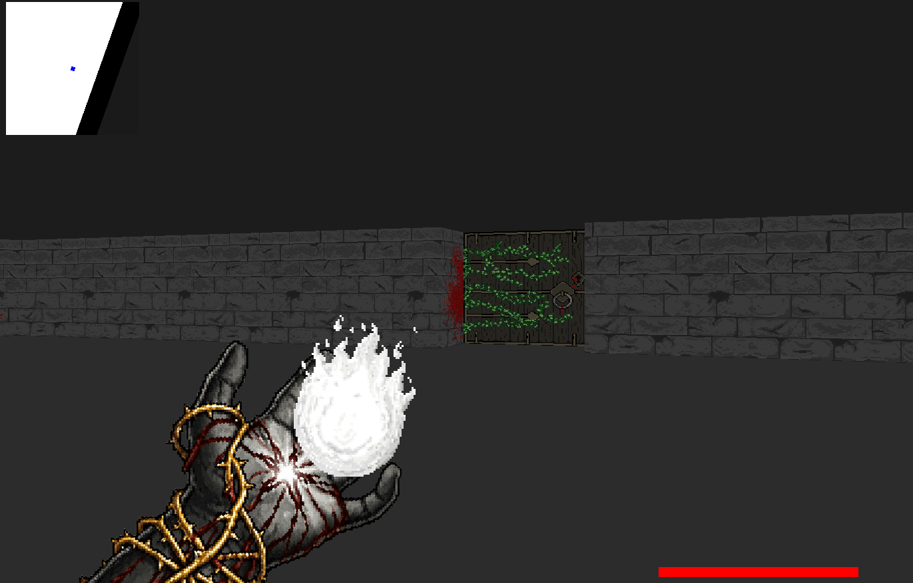

# Cub3D

## Description

Cub3D est un projet graphique de l'école 42 inspiré du célèbre jeu **Wolfenstein 3D**.

L'objectif est de créer un moteur de rendu 3D en pseudo-3D utilisant la technique du **raycasting**. Le joueur évolue dans une map composée de murs, portes et éléments interactifs, avec une vue à la première personne.

Le projet est réalisé en langage **C** avec la bibliothèque graphique **MiniLibX**.

---

# Fonctionnalités

## Moteur graphique

- Rendu 3D temps réel avec raycasting
- Projection des murs avec correction de perspective
- Gestion des textures :
  - murs nord/sud/est/ouest
  - portes
  - sprites
- Gestion de la caméra et du champ de vision
- Affichage d'une minimap

---

## Joueur

- Déplacement :
  - avancer
  - reculer
  - déplacement latéral
  - rotation de la caméra
- Gestion des collisions avec les murs
- Gestion de la position initiale
- Système de vie

---

## Monde et interactions

- Chargement d'une map depuis un fichier `.cub`
- Vérification complète de la map :
  - murs fermés
  - position valide du joueur
  - caractères autorisés
  - chemins accessibles
  - absence de lignes vides dans la map
- Gestion des portes :
  - ouverture
  - fermeture
  - collision dynamique

---

## Ennemis

Le projet contient un système d'entités :

- Création d'ennemis depuis la map (`O`)
- Gestion d'état :
  - patrouille
  - poursuite
  - attaque
  - mort
- Détection du joueur par distance et raycasting
- Collision avec les projectiles
- Gestion des points de vie

---

## Système de combat

- Tir de projectiles
- Collision projectile / environnement
- Collision projectile / ennemi
- Dégâts
- Mort des ennemis

---

# Installation

## Cloner le projet

```bash
git clone https://github.com/votre_nom/cub3d.git
cd cub3d
```

---

## Compilation

Le projet utilise un Makefile.

Compilation :

```bash
make
```

Nettoyage :

```bash
make clean
```

Suppression complète :

```bash
make fclean
```

Recompilation :

```bash
make re
```

---

# Utilisation

Lancer le jeu :

```bash
./cub3d Map/map.cub
```

Exemple :

```bash
./cub3d Map/level1.cub
```

---

# Format des maps

Les fichiers `.cub` contiennent :

## Textures

```
NO Assets/Wall/Wall_01.xpm
SO Assets/Wall/Wall_02.xpm
WE Assets/Wall/Wall_03.xpm
EA Assets/Wall/Wall_01.xpm
```

---

## Couleurs

Sol :

```
F 220,100,0
```

Plafond :

```
C 0,100,255
```

---

## Carte

Symboles utilisés :

| Symbole | Description |
|--------|-------------|
| `1` | Mur |
| `0` | Sol |
| `D` | Porte |
| `O` | Ennemi |
| `N` | Spawn joueur nord |
| `S` | Spawn joueur sud |
| `E` | Spawn joueur est |
| `W` | Spawn joueur ouest |

Exemple :

```
111111
1000D1
10O001
1000E1
111111
```
# Technique utilisée

## Raycasting

Le moteur utilise le raycasting pour transformer une map 2D en rendu 3D.

Pour chaque colonne de l'écran :

1. Un rayon est envoyé depuis la caméra.
2. Le rayon avance jusqu'à rencontrer un mur.
3. La distance au mur est calculée.
4. Une hauteur de mur est déterminée.
5. Une texture est appliquée.

Cette méthode permet d'obtenir un rendu 3D performant sans utiliser de véritable moteur 3D.

---

# Gestion mémoire

Le projet utilise :

- allocations dynamiques contrôlées
- destruction des textures MiniLibX
- libération des listes chaînées
- nettoyage complet lors des erreurs de parsing

Tests effectués avec :

```bash
valgrind --leak-check=full ./cub3d map.cub
```

---

# Contrôles effectués

Le programme vérifie :

✅ fichier `.cub` valide  
✅ textures présentes  
✅ couleurs valides  
✅ map fermée par des murs  
✅ spawn joueur unique  
✅ caractères inconnus refusés  
✅ lignes vides interdites dans la map  
✅ chemins impossibles détectés  

---
# Screenshots



# Technologies

- C
- MiniLibX
- Makefile
- Linux
- Valgrind
- Raycasting

---

# Auteur

@alexrpeter @kryn91